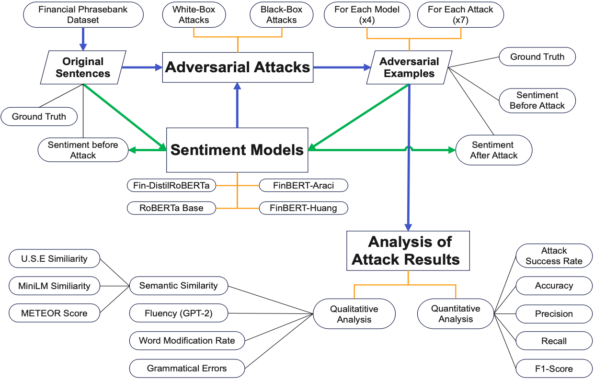

# Adversarial Attacks on Financial Sentiment Classifiers

Code and results for my master's thesis at TUM — *Adversarial Attacks on Deep
Learning Sentiment Classifications in the Context of Financial Texts*.

The question behind it: **financial sentiment models are increasingly trusted to read
earnings reports and news, but how easily can their output be flipped by rewording a
sentence without changing what it means?** To answer that, the study runs seven
adversarial attack algorithms against four transformer sentiment classifiers on a
balanced set of 1,020 financial sentences, and measures not just whether the attacks
succeed but whether the sentences they produce are still *plausible English*.

The short answer: the best attacks flip roughly **69% of predictions while changing about
a quarter of the words**, and the most accurate model in the study is also among the most
fragile.



*The design in one picture: original sentences are classified by four sentiment models,
attacked by seven algorithms, and the resulting adversarial examples are re-classified and
then judged on two axes — did the attack work, and does the sentence it produced still read
like English?*

---

## Headline results

**Baseline accuracy on the 1,020-sentence evaluation set** (before any attack):

| Code | Model | Accuracy | F1 |
|---|---|---:|---:|
| `FA` | [ProsusAI/finbert](https://huggingface.co/ProsusAI/finbert) | **0.909** | 0.909 |
| `DR` | [mrm8488/distilroberta-finetuned-financial-news-sentiment-analysis](https://huggingface.co/mrm8488/distilroberta-finetuned-financial-news-sentiment-analysis) | 0.846 | 0.848 |
| `FH` | [yiyanghkust/finbert-tone](https://huggingface.co/yiyanghkust/finbert-tone) | 0.724 | 0.726 |
| `RB` | [cardiffnlp/twitter-roberta-base-sentiment-latest](https://huggingface.co/cardiffnlp/twitter-roberta-base-sentiment-latest) | 0.543 | 0.534 |

`RB` is a general Twitter sentiment model included deliberately as a non-financial
baseline — its low score is the point, not a bug.

**Attack success rate** (share of correctly-classified sentences that the attack flipped):

| Attack | DR | RB | FA | FH | mean |
|---|---:|---:|---:|---:|---:|
| **PWWS** | 0.686 | 0.685 | 0.713 | 0.688 | **0.693** |
| **TF** (TextFooler) | 0.680 | 0.621 | 0.738 | 0.718 | **0.689** |
| **TBG** (TextBugger) | 0.673 | 0.665 | 0.745 | 0.647 | **0.683** |
| PSO | 0.611 | 0.564 | 0.606 | 0.576 | 0.589 |
| SCPN | 0.573 | 0.457 | 0.703 | 0.493 | 0.556 |
| DWB (DeepWordBug) | 0.487 | 0.379 | 0.518 | 0.504 | 0.472 |
| UAT | 0.037 | 0.095 | 0.032 | 0.025 | 0.047 |

Concretely, `DR` falls from **0.846 accuracy to 0.350** under TextFooler.

Two findings worth pulling out:

- **The best financial model is the most attackable.** `FA` scores highest clean (0.909)
  yet suffers the *highest* success rate for four of the seven attacks. Accuracy on clean
  data says nothing about robustness.
- **UAT barely works here.** Universal Adversarial Triggers prepend one fixed trigger
  phrase to every input rather than tailoring the perturbation per sentence. On this
  domain that costs it almost all of its effectiveness — 4.7% mean success.

**But success rate alone is misleading**, which is why quality is measured too. For `DR`:

| Attack | USE sim. | MiniLM sim. | METEOR | Fluency (GPT-2 ppl) | Grammar errors | Word mod. rate |
|---|---:|---:|---:|---:|---:|---:|
| UAT | 0.942 | 0.984 | 0.942 | 525 | 4.9 | 1.16 |
| **PWWS** | **0.865** | 0.886 | 0.874 | 588 | 6.9 | **0.25** |
| PSO | 0.855 | 0.875 | 0.865 | 631 | 6.9 | 0.25 |
| TF | 0.823 | 0.857 | 0.843 | 692 | 7.0 | 0.30 |
| TBG | 0.806 | 0.806 | 0.805 | 784 | 6.7 | 0.28 |
| DWB | 0.753 | 0.736 | 0.697 | 739 | 8.8 | 0.21 |
| SCPN | 0.581 | 0.663 | 0.454 | 538 | 4.0 | **1.61** |

Read together with the table above, this reframes the ranking:

- **PWWS is the strongest attack overall** — highest success rate *and* the best semantic
  similarity among effective attacks, changing only ~25% of words.
- **SCPN's 55.6% success is expensive.** It paraphrases the whole sentence (word
  modification rate 1.61 — more edits than there are words) and semantic similarity
  collapses to 0.581. It succeeds partly by no longer meaning the same thing.
- **UAT's near-perfect similarity is an artefact** of barely changing anything that
  matters — it appends a trigger and leaves the sentence otherwise intact.

Full per-model workbooks are in [`results/`](results/).

---

## The dataset

**Every result in this repository was produced on
[`datasets/phrasebank_1020_evaluation_set.csv`](datasets/phrasebank_1020_evaluation_set.csv)**
— 1,020 sentences drawn from the **Financial PhraseBank** alone, balanced at exactly
340 negative / 340 neutral / 340 positive.

Two constraints shaped it. Financial PhraseBank is heavily imbalanced (59.4% neutral,
28.1% positive, 12.5% negative), which would distort macro-averaged metrics. And at 4,840
sentences it is far too large to attack exhaustively without cloud compute — a single
attack/model pair takes hours on a laptop, and this study runs 28 of them. So:

1. Load Financial PhraseBank, configuration `sentences_50agree`.
2. Assign a stable `Sentence_ID` — every downstream join depends on it.
3. Drop one known-broken sentence (ID 1664).
4. Downsample to **340 per class = 1,020 total**, `random_state=123` for reproducibility.

That file is committed, so you can reproduce the exact evaluation set without re-running
step 1 — and, more importantly, verify that the published numbers refer to the same 1,020
sentences.

### A second dataset path exists but was not used for these results

`data_merge.py` and `datasets/phrasebank_and_sentfin.csv` implement a **merge of Financial
PhraseBank with SEntFiN 1.1** — keeping only SEntFiN headlines carrying a *single*
sentiment decision (multi-entity headlines have conflicting labels), then deduplicating
twice: identical sentence+label pairs keep the first, while sentences appearing under
*different* labels are dropped **entirely**, since they make correct metrics impossible.

It is kept here because the code supports it and it is a reasonable way to build a larger,
more varied evaluation set. **It is not what produced the tables above.** If you re-run the
notebook as-is you will get the PhraseBank-only 1,020.

---

## How the pipeline works

The whole study runs from [`main.ipynb`](main.ipynb) in nine sections, each calling into
the modules below. Every stage writes its output to disk, so the expensive parts run once.

```
 1  Prepare dataset          load → merge → dedupe → balance → assign Sentence_ID
 2  Execute attacks          7 attacks × 4 models = 28 runs → one JSON per run
 3  Merge results            join attack JSONs back onto the original sentences
 4  Fill failed attacks      failed attacks emit None; backfill with the original
 5  Re-classify              all 4 models re-score every adversarial sentence
 6  Quantitative metrics     accuracy / precision / recall / F1 / attack success rate
 7  MiniLM similarity        sentence-transformers similarity, added alongside USE
 8  Quality metrics          USE, MiniLM, METEOR, fluency, grammar, modification rate
 9  Compare samples          side-by-side diff of original vs adversarial sentences
```

**Step 4 exists for a subtle reason.** When an attack fails it produces no adversarial
sentence — a `None`. Left alone, those rows break re-classification in step 5 and, worse,
would silently be dropped from the metrics, inflating every score. Backfilling with the
original sentence keeps the denominator honest: a failed attack counts as the model
getting it right.

### Modules

| File | Responsibility |
|---|---|
| `data_loading.py` | Loads Financial PhraseBank, SEntFiN, financial tweets; normalises column names and label encodings to `0=negative, 1=neutral, 2=positive` |
| `data_processing.py` | Label standardisation, class-balanced downsampling, `Sentence_ID` assignment, broken-sentence removal |
| `data_merge.py` | Merges the two corpora with the two-pass dedupe; joins attack-result JSONs back onto the dataset |
| `victim_sentiment_models.py` | Builds the four victim models as OpenAttack `TransformersClassifier` objects, wiring the right embedding layer (`model.roberta.*` vs `model.bert.*`) |
| `openattack_recipes.py` | Registry of **15** OpenAttack attackers behind short codes |
| `openattack_iteration.py` | Runs attack × model combinations, attaches the quality metrics, prints ETA, writes timestamped JSON, and **skips combinations already on disk** so an interrupted run resumes |
| `sentiment_classifiers.py` | HuggingFace `pipeline` wrappers for batch re-classification, with per-model label maps (note `FH` capitalises its labels) |
| `result_processing.py` | Discovers result JSONs by filename pattern, merges per model, fills `None` for failed attacks |
| `evaluation_quant.py` | Accuracy / precision / recall / F1 before and after, attack success rate, and the before-vs-after delta table |
| `evaluation_quality.py` | USE similarity, MiniLM similarity, METEOR, GPT-2 perplexity, grammatical errors, word modification rate — **averaged over successful attacks only** |
| `helper.py` | Directory setup, dataset discovery, column-name standardisation, and the HTML diff highlighting used in section 9 |

### Short codes

Used throughout filenames and result indices.

**Models** — `DR` DistilRoBERTa-financial · `RB` Twitter RoBERTa · `FA` FinBERT (Araci/ProsusAI) · `FH` FinBERT-tone (Huang)

**Attacks evaluated** — `PWWS` · `TF` TextFooler · `TBG` TextBugger · `PSO` · `SCPN` · `DWB` DeepWordBug · `UAT`

**Also wired but not evaluated** — `BAE` · `BERT` · `FD` · `GAN` · `GEO` · `GEN` · `HOT` · `VIP`. `openattack_recipes.py` supports 15 recipes; the thesis ran the 7 above, chosen as three priority tiers to fit the compute budget.

---

## Running it

```bash
git clone https://github.com/ysabanoglu/adversarial-attacks-financial-sentiment.git
cd adversarial-attacks-financial-sentiment

python3.12 -m venv .venv && source .venv/bin/activate
pip install -r requirements.txt

# OpenAttack is installed from source — see the note in requirements.txt
git clone https://github.com/thunlp/OpenAttack.git
pip install -e OpenAttack

jupyter notebook main.ipynb
```

Then run `main.ipynb` top to bottom. Section 1 rebuilds the dataset, section 2 runs the
attacks.

**Expectations before you start:**

- **Time.** The 28 attack/model combinations are the bottleneck — hours each on CPU, and
  section 2 is the reason the pipeline caches aggressively. `run_attacks()` skips any
  combination whose result JSON already exists, so you can stop and resume freely.
- **Disk.** OpenAttack downloads ~2.3 GB of assets on first use (Universal Sentence
  Encoder, Stanford Parser, SCPN and SGAN checkpoints, NLTK data) into `data/`. That
  directory is gitignored.
- **SSL.** OpenAttack's downloads fail behind some corporate/university networks. The
  notebook sets a `certifi` CA bundle explicitly in section 2 to work around this.
- **Hardware.** Everything here ran on a laptop CPU. A GPU mainly speeds up
  re-classification (step 5), not the attack search itself.

---

## Data and licensing

The code in this repository is MIT licensed. **The datasets are not mine** and keep their
original terms:

- **Financial PhraseBank** — Malo et al. (2014), *Good debt or bad debt: Detecting
  semantic orientations in economic texts*. Released CC BY-NC-SA 3.0. Loaded at runtime
  from HuggingFace (`financial_phrasebank`); the 1,020-sentence subset used for the
  experiments is redistributed here under the same licence.
- **SEntFiN 1.1** — Sinha et al. (2022), *SEntFiN 1.0: Entity-aware sentiment analysis
  for financial news*. `datasets/SEntFiN-v1.1.csv` is redistributed here for
  reproducibility; please cite the original authors if you use it.
- `datasets/phrasebank_1020_evaluation_set.csv` (the actual evaluation set) and
  `datasets/phrasebank_and_sentfin.csv` (the unused merge) both derive from Financial
  PhraseBank, so **both are distributed under CC BY-NC-SA 3.0** — attribute the original
  authors, non-commercial use only, and license any derivative the same way. See
  [`datasets/LICENSE`](datasets/LICENSE).

Model weights belong to their respective HuggingFace authors and are downloaded at
runtime.

---

## Citation

```bibtex
@mastersthesis{sabanoglu2024adversarial,
  title  = {Adversarial Attacks on Deep Learning Sentiment Classifications
            in the Context of Financial Texts},
  author = {Sabanoglu, Yigit},
  school = {Technical University of Munich},
  year   = {2024}
}
```

Built on [OpenAttack](https://github.com/thunlp/OpenAttack) (Zeng et al., 2021) and
[TextAttack](https://github.com/QData/TextAttack) (Morris et al., 2020).
